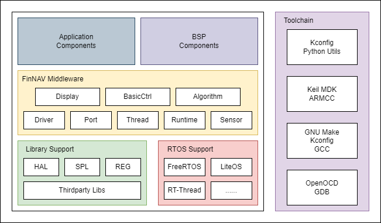

# FinNAV 构建系统

本文档详细描述了FinNAV使用的构建系统Makefile框架。

>  本文档适合开发者参考

FinNAV使用**GNU Make**作为构建系统，使用Linux主线的Kconfig作为条件编译配置工具，在Windows系统下支持Kconfig-python包进行条件编译配置。

## Makefile组织结构

FinNAV将Makefile分成**主Makefile**和**从Makefile**。主Makefile被放置在`FinNAV根目录`下；从Makefile则根据不同的作用范围被放置在`Application`、`FinNAV`、`Kernel`、`Lib/main`、`Testbench`等目录下。此外，还有位于`build`目录的**辅助Makefile**

作为核心的主Makefile文件作为make的入口文件。其主要作用是调用Kconfig工具进行条件编译配置，随后调用从Makefile以完成编译任务。主Makefile优先包含下列辅助Makefile：

* `build/build_verbosity.mk`：定义V=\<verbosity\>的值以进行调试输出。如果使用V=1，则会输出所有receipt指令信息和调试信息；如开启V=0，则只会输出表征当前运行情况的用户信息
* `build/utils.mk`：给出了一些常用函数
* `build/download.mk`：用于处理OpenOCD通用下载，该文件也包含了部分从Makefile的功能
* `build/parse.mk`：用于解析.config文件
* `build/system.mk`：判断当前Makefile的运行环境从而自动选用工具链

在完成条件编译配置后，Kconfig将生成`build/target/kconfig/.config`文件（下面简称.config文件），主Makefile将使用`build/parse.mk`解析该文件，并将从Makefile需要的参数export出来

> FinNAV的.config不被直接引用，这是为了适配不同子模块的Kconfig输出。一些外部子模块需要带CONFIG\_前缀的Kconfig输出，另一些则要求不带前缀，FinNAV选择统一生成不带CONFIG\_前缀的.config文件，修改Kconfig文件来生成符合子模块标准的输出，同时在FinNAV构建组件使用前将变量名变换成适合的格式（比如TARGET_APP、TARGET_SOC、TARGET_BSP三个变量）

完成配置后，根据用户指令不同，主Makefile会选择不同目录下的从Makefile执行，完成用户指定的目标——实际上，Kconfig也是由`Toolchain/kconfig`目录的从Makefile调用的。但是如果用户不生成.config文件，也不指定一个`CONF=`模板配置文件，FinNAV无法自动生成可用的构建配置，就会发出警告和报错

以`make lib`指令为例。在编译期间，make进入`Lib/main/Makefile`，优先包含以下辅助Makefile：

* `build/build_verbosity.mk`：提供调试输出开关
* `build/utils.mk`：提供常用函数支持
* `build/system.mk`：判断当前Makefile的运行环境
* `build/libtarget.mk`：提供编译环境需要的函数和变量模板
* `build/compile.mk`：提供所有编译参数

同时，根据.config配置文件的内容，还会调用SoC和RTOS相关的**移植Makefile**。所有移植Makefile都被放在`build/target/soc`和`build/target/rtos`目录，这里以stm32f4、FreeRTOS为例

* `build/target/soc/STM32F4.mk`：提供STM32F4系列SoC特定的驱动库、头文件、编译参数等
* `build/target/rtos/FreeRTOS.mk`：提供FreeRTOS特定的源文件、头文件、编译参数等

在以上Makefile的支持下，编译得以进行。从Makefile的作用主要是确定当前构建的目标和要使用到的源文件族，具体的依赖、头文件、静态库甚至编译目标都被交给了辅助Makefile

总体来说构建系统的结构比较简单，只在比较关键的编译部分做了函数化，开发者可以自行阅读源码（可以重点阅读主从Makefile以概览编译框架）

### 编译目标

FinNAV的最终编译目标即`app`，被称为**FinNAV应用程序**。其他所有编译目标都为`app`服务，包括SoC外设库与启动文件目标`lib`、RTOS内核与系统级外设驱动框架目标`kernel`、FinNAV中间件及外设驱动框架目标`librov`。当然，FinNAV还通过Makefile内置了编译工具链的配置和可执行文件下载的功能，这里不再介绍。

不过所有四个主要目标都可以单独执行，且`lib`、`kernel`、`librov`都**支持被编译为静态库**供外部程序调用。所有编译输出会被存放在`build/out`目录下。包括`.elf`、`.bin`、`.hex`格式的FinNAV应用程序可执行文件和`libxxx.a`格式的静态库文件

FinNAV将当前.config配置文件指定的配置参数称为**活动目标**（Active Target），类似Eclipse IDE的活动工程目标。**同一时刻，FinNAV工程只支持一个活动目标存在**，对当前活动目标的编译会覆盖上一个活动目标的编译结果

> FinNAV会按照活动目标中的**编译环境特征**，即`FinNAV应用程序目标名`-`SOC系列目标名`-`RTOS目标名`-`HAL目标名`-`FinNAV中间件版本`参数来决定编译输出目录名——这会导致两个具有一定差别的活动目标，若具有相同的编译环境特征，就会输出到相同的目录下，且后编译的输出会覆盖之前编译输出。
>
> 不过该特性会让用户在编译具有相同编译环境特征目标时无需重新编译作为依赖库的`lib`、`kernel`目标，对于相同版本的`librov`目标，也只需要增量编译
>
> 同时，FinNAV还会采用复制的方式将编译输出目录内的可执行文件复制到`build/out`下，这是为了方便OpenOCD从固定路径下载可执行文件到设备，但会导致活动目标的覆盖

### 源文件结构

由于嵌入式程序整体代码结构趋于固定，FinNAV参考了betaflight的源文件组织方式，但采用目录+过滤的方式减少构建文件代码量。

基础的原厂外设库、启动文件和RTOS源文件都在移植Makefile中指定。为了方便对接内核，RTOS源文件采用逐条路径的方式添加，可以参考`build/target/rtos`下的任意Makefile。而其他源文件都采用目录形式加入，不需要编译的文件则被加入`EXCLUDE`文件，在源文件列表进入编译指令模板前被排除掉。

头文件目录根据当前条件编译配置选项加入编译指令模板，条件编译配置选项也决定了部分源文件是否要被加入编译指令模板

### 库文件结构

FinNAV会使用静态库整合各个不同代码子系统。编译中会生成三个关键静态库：

* lib\<hal\>.a：所有编译出的原厂外设库、启动文件和第三方底层库目标文件的集合
* lib\<rtos\>.a：所有RTOS内核、系统级驱动框架目标文件的集合
* librov.a：所有FinNAV中间件和外设驱动框架目标文件的集合

三者均可以作为对应目标的静态库单独使用。FinNAV应用程序会默认链接三个库文件获得可执行文件（如果不使用rtos也不使用FinNAV中间件，则只会链接一个外设库文件）

三个库文件会被生成并存放在`build/out/<Active Target>`目录下，该目录也是库文件搜索目录和`.map`文件的生成目录

## Kconfig组织结构

FinNAV使用Kconfig工具进行图形化条件编译配置，而Kconfig配置文件是使用Kconfig工具的关键。FinNAV将所有基础配置文件都放在`build/kconfig`目录下；FinNAV中间件和RTOS的Kconfig配置文件则保存在`FinNAV`目录和`Kernel`目录，与源文件同时放置

### 核心Kconfig

### RTOS Kconfig

### FinNAV LibROV Kconfig

## 移植Makefile接口变量

为了方便用户移植，SoC和RTOS的移植Makefile只需要提供下列标准接口变量，FinNAV会自动将这些变量放入编译指令模板

### SoC Makefile

### RTOS Makefile
