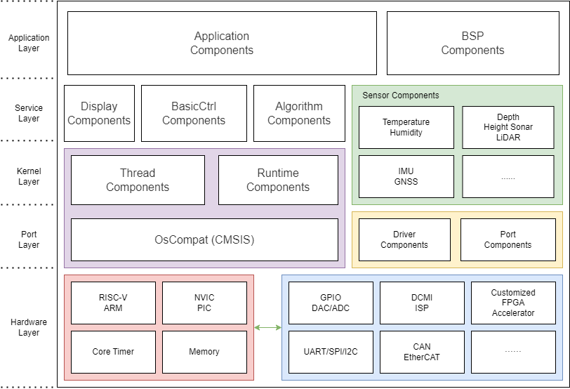

# FinNAV 层次结构描述

本文档对FinNAV SDK的核心组件FinNAV中间件软件（FinNAV Middleware，或称LibROV）结构提供说明。更多内容可以参考FinNAV源码

## 设计背景

随着OurEDA水下机器人技术迭代，原有的小型控制库Lib-ROV变得越来越臃肿。在未来，我们还将引入更多不同BSP、不同外设、不同内核架构的嵌入式主控方案。FinNAV的设计初衷是让同一套嵌入式软件能够快速部署于不同硬件的水下机器人上，并集成姿态稳定、航向保持、深度保持、机械臂控制等算法供用户按需调用

不同于其他飞控方案——一般的飞控软件都只能运行在固定的几个SoC甚至固定的BSP上；FinNAV将在不同SoC、不同内核上运行，用户只需要使用图形化界面设置一些参数，并完成需要外设驱动库的底层移植，这和RTOS的移植过程非常相似。

但也不同于传统实时操作系统——大多数RTOS都需要接管内核定时器、中断控制器，实现线程（在嵌入式意义上的）调度，甚至提供完善的驱动框架；FinNAV允许用户选用适合当前芯片的不同RTOS内核来实现线程调度，也允许用户加入一个软件定时器列表来进行基于裸机的开发，同时提供了一个非常简单的可选的外设驱动框架来统一底层操作。用户可以在RTOS或HAL的基础上使用FinNAV提供的算法服务

> 在未来，FinNAV可能会加入一套基于有栈协程的任务调度系统，不过即使如此，FinNAV也应当作为中间件而不是RTOS

而且不同于基本的运行时——FinNAV为上层应用提供一个完整的运行时环境，但并不会对底层API作高层次抽象（虚拟化），只会将底层API进行封装后暴露给用户，用户可以自行选择使用FinNAV API还是通过更强大的操作系统调用底层硬件（比如将FinNAV的某些组件部署到嵌入式Linux上）

因此FinNAV被定义为一个类似AutoSAR的**中间件**（Middleware），分别提供面向底层硬件的操作系统兼容层（Port组件）、外设驱动框架（Driver组件）和面向用户的API（Kernel层和Service层的其他组件）。FinNAV处理操作系统调用、硬件抽象库或直接寄存器操作、内存映射等基础组件；同时为上层机器人控制提供外设驱动、内核线程管理、控制算法、传感器解析等服务

## 硬件层 HardwareLayer

硬件层是开发者移植时需要考虑的部分，但在开发应用程序时不需要处理。

硬件层是对器件内核、SoC外设和板级外设的封装，所有描述都被存放于 `Boards` 目录下。本层不包含FinNAV组件，但开发者需要编写一组板级支持包（BSP）来适配CPU的中断、内核定时器、存储器管理及其他片上/板级外设驱动。用户还应当实现FinNAV规定的BSP标准接口，底层SPL、HAL、寄存器库的API都应当对接到接口并实现预期的功能。

开发者在移植时按需编写以 `BSP_` 开头的BSP目录，必要的子目录如下所示：

* **Core**：外设初始化代码，例如CubeMX生成的外设配置文件
* **Port**：位于FinNAV移植层的Port组件

可选的子目录如下所示：

* Drivers：RTOS/中间件所需的驱动适配代码，例如RT-Thread所需的BSP文件
* <第三方库>：FinNAV支持的第三方库所需驱动适配代码

本层提供了可扩展的示例模板，开发者可以在模板基础上实现自己需要的BSP

## 移植层 PortLayer

移植层由FinNAV提供，但针对每款SoC，开发者需要拷贝模板文件到 `Boards/BSP_<板级支持包名称>/Port` 目录下，并根据需要的片上外设自行编写驱动适配代码。

> 如果开发者不需要使用到FinNAV驱动框架，可以只拷贝模板文件到目录

该层包括**操作系统适配组件OsCompat**、**统一驱动框架组件Driver**和**SoC移植组件Port**，为上层代码提供片上外设读写和特殊操作。OsCompat组件是一套基于CMSIS-RTOS的RTOS兼容层；Driver组件是FinNAV外设驱动框架的主体，提供一些方便的外设调用功能；Port组件是需要用户自行完成的部分：FinNAV会针对不同的操作系统和外设驱动给出通用的驱动框架接口（这就是Driver组件要完成的任务），用户需要自行完善Port组件代码，并使用驱动框架API将设备驱动注册到Driver组件中，以便上层应用调用低层次API。

开发者能使用FinNAV驱动框架或RTOS驱动框架：通过在menuconfig选项中使能/禁用FinNAV外设驱动框架/RTOS驱动框架来切换。

FinNAV的基本移植对象是*SoC硬件*和*RTOS软件*。硬件库接口需要开发者在硬件层完成，并在移植层进行注册，软件移植则只需要用户在Kconfig界面中选定所需RTOS内核，FinNAV会提供基于Kconfig的RTOS配置界面

## 内核层 KernelLayer

内核层由FinNAV提供。

本层包含**线程调度组件Thread**和**运行时组件Runtime**。FinNAV不包含线程调度器，最多提供基于软件定时器的简单任务切换功能，因此需要使用外部的RTOS来进行线程调度和IPC。Thread组件是对RTOS任务/线程/进程调度器和内核对象的封装，同时提供中断管理、软件定时器等功能。Runtime组件基于OsCompat组件提供的API为上层组件提供基础的线程间同步/通信、简化的C标准库函数、调试等功能。对于资源紧张设备，FinNAV还提供一套裸机可用的软件定时器列表并封装为内核层API。

此外，一些需要直接调用底层API的传感器驱动也会在本层得到封装。

Runtime组件还为调试输出（Console）和堆栈调试（BackTrace）提供了低层次驱动实现，支持调试串口和OSD输出。为了实现调试输出，集成了可选的*轻量级日志库Rlog*。Rlog是基于开源嵌入式日志库ulog的日志库，该库与FinNAV本体具有不同的License，在项目根目录中已附上版权声明

由于RTOS内核通常不区分用户态或内核态，FinNAV中间件也提供用户透明的服务——用户有权调用所有低层次的API。FinNAV提供两种中断调用的方法：回调函数和直接编辑。用户可以直接修改外设中断服务函数实现自己想要的功能，但该情况下就无法使用外设驱动框架提供的方便功能。也可以使用外设驱动框架提供的接口将钩子函数注册到中断服务函数，FinNAV会调用RTOS的中断管理服务处理这些钩子函数。这部分工作会被Runtime组件完成

## 服务层 ServiceLayer

服务层由FinNAV提供。

本层包含了用户可以直接调用的**算法组件Algorithm**、**机器人控制组件BasicCtrl**，还提供用于OSD、显示屏等外设输出的**显示组件Display**，用于传感器读取和分析的**传感器组件Sensor**也被归为服务层。

Algorithm组件是FinNAV中间件的重要组成部分，包含数学库、控制算法和常用的不涉及外设操作的业务逻辑。其中部分算法需要调用低层API实现硬件加速，在用户使能DSP或FPGA外设驱动后可自行配置。

BasicCtrl组件主要用于各种不同场景下的机器人控制，尤其涉及到关于异步IO的业务逻辑。组件内也包括RovLink的编解码API，用户可以使用固定版本API或基于Bubbler工具生成所需代码。

Display组件用于OSD或其他显示器的显示，同时能够将底层代码生成的调试信息格式化打印在屏幕上。

Sensor组件专门用于异步的传感器数据处理，包括传感器初始化、重初始化、暂停/关闭、读取、写入等功能，开发者可以通过组件提供的标准API注册传感器驱动，FinNAV将以回调的方式为用户提供传感器读取和分析输出。Sensor组件以包的形式管理传感器驱动。如果开发者需要添加一个新的传感器驱动程序，需要在 `Sensor/packages` 目录下创建一个传感器包，向FinNAV提供标准的注册接口。

## 应用层 ApplicationLayer

应用层是用户需要实际编写的部分，用户的机器人业务逻辑工作在该层。

该层包括**应用程序组件Application**和**板级支持包组件BSP**（Board Support Package）两部分。

板级支持包相关内容在上文中已得到叙述，但用户在移植时还需要使用厂商的代码自动生成工具创建或手动编写HAL/SPL层次的外设初始化程序，将其保存在 `Boards/BSP_<BSP名称>/Core` 目录下，同时将用到的第三方库驱动代码放置在 `Boards/BSP_<BSP名称>/<第三方库名称>` 目录下

用户应当在Application组件目录（`Application` 目录）放置必要的应用程序源文件和面向业务的库文件。