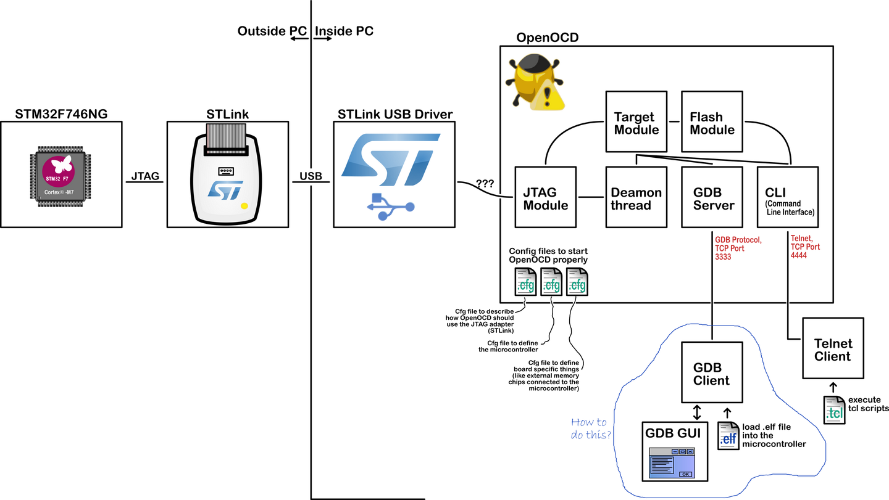

# FinNAV SDK Debug说明

FinNAV支持基于VSCode-GDB-OpenOCD的调试工具链，根据本文档来部署并使用VSCode进行可视化的调试。



调试需要用到4个关键组件，如上图所示：

* 调试器软件：用于发出调试指令、设置断点等。常见的包括LLDB和GDB，FinNAV是基于GNU工具链的SDK，因此使用**GDB**
* 调试适配器（Debug Adapter）：接收调试器软件的指令，并与嵌入式平台进行通信，相当于JTAG的通用驱动软件。FinNAV使用开源的**OpenOCD**
* 调试仿真器：将PC从USB发出的数据转换为标准JTAG数据，与目标嵌入式平台内部的调试电路直接通信。市面上有多种支持JTAG的设备，包括J-Link (Pro)、ST-Link、DAP-Link、SmartLynq等
* 片上CoreSight：嵌入式平台内部负责调试的电路，能够向CPU发出调试中断、在指令中插入断点等。由芯片厂商决定其行为和通信接口规范

为了方便调试，GDB提供了*文本用户界面*，可以方便地显示源代码、汇编和寄存器文本窗口，使用`gdb -tui`启动；但现在是21世纪，FinNAV选择更好用的**VSCode**进行图形化调试

跟随以下步骤部署整套工具链

### 安装基础工具链

切换到FinNAV根目录，首先使用指令

```shell
make openocd-prepare
```

安装OpenOCD到FinNAV

随后使用指令

```shell
make gcc-prepare
```

安装适合操作系统的GCC到FinNAV，GDB工具已经包含在其中

最后从[微软官网](https://code.visualstudio.com/Download)下载适合操作系统的VSCode安装包，并安装`C/C++`插件和`Cortex-Debug`插件

> 此外，用户还应根据[FinNAV 快速入门](./FinNAV_Tutorial.md)所述完成make工具的配置，并提前安装好Kconfig-python工具所需依赖（*如果在Linux环境中使用Kconfig，无需安装依赖，第一次启动menuconfig时会自动完成编译*）

### 配置VSCode

使用VSCode打开FinNAV根目录，建立`.vscode`子目录，并将`build/VSCode/launch.json`和`build/VSCode/tasks.json`复制到`.vscode`目录

侧边栏切换到*运行和调试*，可以发现多出了`FinNAV Debug`选项

快捷键`Ctrl+Shift+P`，输入指令`Run Task`可以发现多出了*flash*、*build*、*openocd*三个任务

### 连接设备并进行menuconfig配置

将目标嵌入式平台与PC连接，使用指令

```shell
make menuconfig
```

进行图形化配置，得到`.config`配置文件

**注意：如果需要启用调试，必须在配置时启用`FinNAV Toolcahin Configuration`-`Compile for Debug`选项，启用后，`Compile Optimization Level`条目将无效化，FinNAV会自动指定编译优化等级为`-Og`**

>如果用户需要以-O0进行调试编译，需要选择自行修改Makefile文件，对应文件路径为`build/compile.mk`

用户也可以使用指令

```shell
make saveconfig SAVE=<config_name>
```

保存当前配置文件到`build/configs`目录

### 编译工程并调试

完成配置后，就可以使用VSCode的Task功能调用make工具进行编译和调试了

执行`build`任务，可以一键构建当前配置好的任务（需要提前使用`make menuconfig`得到配置文件）；执行`flash`任务即可将编译得到的二进制文件通过烧录器烧录进目标嵌入式平台；执行`openocd`任务，可以手动启用OpenOCD调试服务器，完成启动后，可在新终端通过telnet等方式手动执行GDB/GDB-TUI或输入调试指令脚本

完成编译后，可以选择烧录并调试，也可以直接点击VSCode界面的`FinNAV Debug`选项进入调试界面