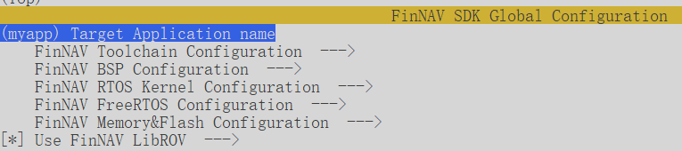
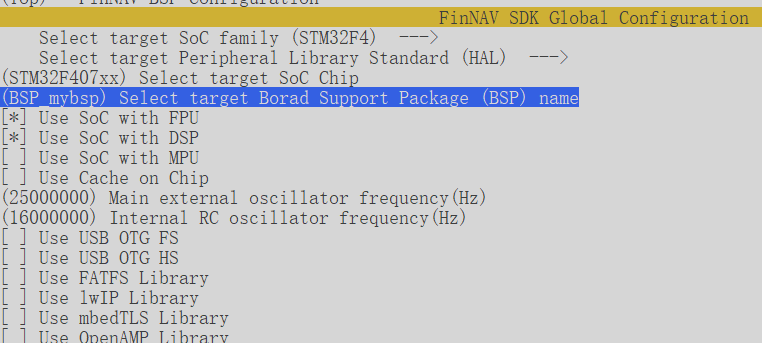

# FinNAV SDK 使用说明

FinNAV SDK使用外设库-RTOS-BSP-应用程序的层次结构对项目进行构建和编译。如果您希望在BSP未支持的开发板上运行FinNAV工程，就需要通过menuconfig界面指定参数，并自行编写符合要求的BSP和应用程序。

本文档介绍了如何确定目标、编写BSP以及BSP、应用程序文件的基础要求。您可以跟随本文档快速将FinNAV应用于您的机器人项目。更多深入内容请参考其他文档

## 确定基础目标

FinNAV能够支持运行的设备条件统称为**目标**（Target），在开始部署前，您应当确定目标是否符合FinNAV当前开发现状；如果FinNAV不支持您的工作目标，可能需要花费额外的经理进行移植

1. 确定目标SoC（**Target SoC**）

    目前FinNAV支持的SoC目标可以在项目根目录下的 `README.md` 文档中简介一章找到。Target SoC是使用FinNAV编译框架的充分条件：如果您的Target SoC未得到支持，将根本无法进行编译

2. 确定要使用的外设库（**Target Lib**）

    FinNAV支持标准库和HAL库，同时对部分设备的原厂SDK提供支持。；如果您的Target Lib未得到支持，只能换用另一种原厂外设库进行开发

3. 是否使用RTOS（**Target RTOS**）

    您可以自行选择使用不同的RTOS内核，或者基于裸机进行开发

4. 是否使用FinNAV中间件（**LibROV**）

    您可以自行选择启用FinNAV中间件，或者将FinNAV作为一套单纯的编译框架

## 基于STM32的部署工作流

> [!NOTE]
>
> 本文档以STM32F407VB为例，使用HAL库裸机编译，不使用FinNAV框架。您可以自行探索Kconfig菜单了解能够使用的库选项

### 从CubeMX工具创建BSP和应用程序APP

首先，您需要使用CubeMX工具自动生成一份初始化代码，这里不再赘述配置过程，您可以选择生成 `基于Makefile的工程` 。完成后，将生成源码中的**Core目录**复制到*BSP目录*下。

BSP目录是位于Boards目录下的一个子目录，您可以自行命名，但要求格式为 `BSP_<name>` ，也就是前缀必须是 `BSP_` 才可以被认为是BSP目录。完成复制后，目录结构如下

```
FinNAV根目录
└── Boards
    └── BSP_mybsp
        └── Core
            ├── Src
            └── Inc
```

完成后，您需要将Core/Src目录下的 `main.c` `stm32f4xx_it.c` 文件和Core/Inc目录下的 `main.h` `stm32f4xx_it.h` 文件剪切到*App目录*。

App目录是位于Application目录下的一个子目录，您可以以任意格式命名，但要求子目录中必须包括 `Src` 和 `Inc` 目录，将剪切出的.c文件和.h文件分别存放在内，即形成如下目录结构

```
FinNAV根目录
└── Application
    └── myapp
        ├── Src
        └── Inc
```

这样就完成了所有文件的添加

> [!IMPORTANT]
>
> 如果您希望使用RTOS，那么就需要额外将CubeMX生成的 `freertos.c`  或类似文件复制到*App目录/Src*下
>
> 如果您希望使用第三方库（比如FatFS），那么还需要将CubeMX生成的 `FATFS` 目录整体复制到*BSP目录*下
>
> 总的来说，您需要将与业务逻辑/算法有关的文件归档到App目录；只需要依赖原厂外设库就可以编译的驱动/库文件归档到BSP目录。在编译层面，App目录需要依赖BSP目录的编译结果

### 编写BSP

如果您不需要使用FinNAV中间件的外设驱动框架，那么本节可以跳过。如果您希望使用FinNAV中间件，并开启外设驱动框架支持，那就需要编写 `Boards/BSP_<name>/Port` 目录下的外设驱动。该目录的结构如下

```
FinNAV根目录
└── Boards
    └── BSP_mybsp
        ├── Core
        └── Port
        	├── Src
        	|	├── bsp_gpio.c
        	|	├── bsp_uart.c
        	|	└── bsp_xxx.c
        	└── Inc
        		└── bsp_<target_soc>.h
```

您需要将FinNAV提供的外设驱动框架头模板文件 `bsp_<target_soc>_template.h` 复制到*Port/Inc目录*下，并根据需要修改内容。同时您必须为选中的外设设备提供驱动框架c文件适配，以便于FinNAV将初始化代码注册到驱动框架。这些C文件都被保存到*Src/bsp_xxx.c*中

推荐使用内置的外设驱动适配模板

### 编写APP

编译前，您可以使用 `make menuconfig` 指令配置所需工程。

必须指定的配置项包括

* Target Application name：即上文中指定的App目录名，

    

* FinNAV BSP Configuration - Select target SoC family：即Target SoC Family

* FinNAV BSP Configuration - Select target Peripheral Library Standard：即Target Lib

* FinNAV BSP Configuration - Select target SoC Chip：即Target SoC

* FinNAV BSP Configuration - Select target Borad Support Package (BSP) name：即上文中指定的BSP目录名

    

完成基本选项配置后，您可以根据需要指定其他参数，具体请参考Kconfig菜单

配置完成后保存到 `.config` 文件，您就可以在App目录下编写业务逻辑了。

### 编译生成和烧录

使用指令

```shell
make build
make flash
```

进行编译和烧录

具体内容请参考 `FinNAV 快速入门` 文档
