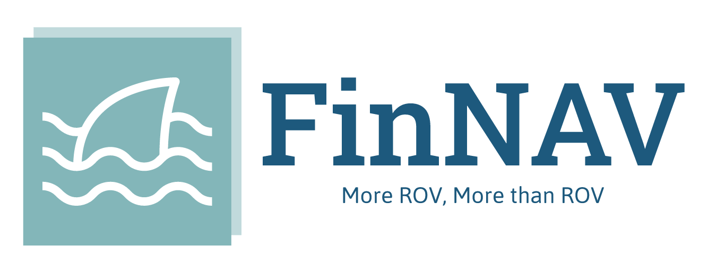

# 鳍航 FinNAV

				

针对水下机器人（ROV/AUV）设计的飞控固件库。

> 基于Lib-ROV OurEDA水下机器人控制库
> **本仓库是FinNAV的开源版本，不包含涉及实际应用的业务逻辑，只包含完整版的FinNAV SDK和LibROV**

## 特性 Features

* ✂ **可裁剪的传感器和执行器驱动**
* 🚢 **支持RovLink协议**
* 👷 **安全的静态内存管理，可预测的响应时间**
* 🔧 **基于GNU/Make的工具链，可快速移植到不同平台**
* 📦 **FPGA和硬件加速器适配**
* ✅ **可裁剪，图形化配置界面**
* ❤ **More ROV, More than ROV**

## 简介 Summary

本项目**鳍航**（**FinNAV**）是为MCU编写，并针对水下机器人应用优化的嵌入式机器人电控固件库，可在无人车（AGV）主控、四轴无人飞行器（Drone）飞控、水下机器人（ROV/AUV）主控等设备中使用。

FinNAV-LibROV支持基于**RovLink**协议的数据传输，并提供基于**Bubbler**生成的C语言序列化/反序列化（Ser/Des）API。RovLink的具体规范可参考外部资料。设备可使用RovLink与**CoralReef**上位机建立连接。

本项目是包含FinNAV固件库（即LibROV）的软件开发工具包（Software Development Kit，SDK），提供FinNAV中间件（FinNAV Middleware）、用户可选的RTOS内核支持（Kernel）、芯片原厂驱动库（Lib），并提供一套构建工具链（Toolchain）。用户能够使用 `make` 工具完成FinNAV固件的二次开发（Application）和板级移植（BSP）。此外，本项目还包含项目文档（Doc）、例程和辅助测试样例（Testbench）。

### FinNAV SDK

本项目也可作为通用的嵌入式开发SDK。允许用户选择需要的MCU、外设库、RTOS、应用程序目标来进行开发。本项目计划支持的目标项如下表所示（其中标记了当前版本支持项和不支持项），更多信息可自行使用 `make menuconfig` 指令查询配置菜单

| Target SoC  | Target Lib  | Target RTOS    | Target BSP     | Target Application |
| ----------- | ----------- | -------------- | -------------- | ------------------ |
| STM32F4xx✅  | ST HAL✅     | FreeRTOS✅      | OurCoreBoards🔧 | f407_finnav🔧       |
| STM32G4xx✅  | ST SPL✅     | LiteOS🔧        | FK407-M1🔧      | f407_cavier🔧       |
| STM32H7xx✅  | AT SPL❌     | RT-Thread✅     | FK407-M3✅      |                    |
| Hi3863❌     | Hi3863 BSP❌ | OpenHarmony-m🔧 | FK750-M1🔧      |                    |
| HC32F460🔧   | HC32F4 SPL🔧 |                | Fiskin🔧        |                    |
| AT32F4xx❌   | AMD BSP🔧    |                |                |                    |
| MicroBlaze🔧 |             |                |                |                    |

FinNAV SDK采用 `make` 作为构建工具，使用 `kconfig` 作为条件编译工具，基于 `openocd` 执行调试和烧录。项目允许在Linux或Windows平台上运行，Linux下工具链采用纯C编译；Windows下工具链需要借助Python运行。由于make工具只能在Linux环境使用，用户需要提前在Windows中安装基于Cygwin或MinGW的gnu-make工具，或使用WSL进行开发编译。

项目目录结构如下所示

* **Application**：应用程序源码目录
* **Boards**：板级支持包源码目录
* **build**：构建系统源码、脚本和编译输出目录
* **Doc**：项目开发文档和基本API介绍
* **FinNAV**：FinNAV中间件（LibROV）源码目录
* **Kernel**：嵌入式操作系统源码目录
* **Lib**：芯片原厂内核/外设驱动库源码和第三方库源码目录
* **Testbench**：示例项目（Demo）和单元测试（Testcase）目录
* **Toolchain**：工具链源码和可执行文件目录

### FinNAV Middleware

FinNAV中间件是从*OurEDA Lib-ROV水下机器人控制库*发展而来的机器人实时控制中间件，提供机器人控制所需的SoC片上外设驱动、RTOS兼容、DSP数学库、常用控制算法、OSD和调试输出、传感器采集和处理等功能

> [!IMPORTANT]
>
> FinNAV SDK允许用户不使用FinNAV中间件编译裸机/RTOS程序，或将FinNAV中间件编译为静态库导出另作他用。

FinNAV软件划分为5层：

* **硬件层** Hardware Layer：FinNAV提供BSP配置模板，用户根据需要对模板进行编辑，将FinNAV移植到不同SoC；如果用户需要使用FinNAV外设驱动框架，还需要自行重定向SoC厂商提供的SDK，编写适配FinNAV驱动框架的底层函数。
* **移植层** Port Layer：FinNAV提供简单的设备驱动框架和操作系统适配，在menuconfig中选中需要的RTOS内核，并根据BSP选定硬件抽象层，即可使用CMSIS-RTOS API和FinNAV Driver API来控制外设；此外，库中还包含了对FPGA自定义片上外设的驱动框架支持
* **内核层** Kernel Layer：FinNAV不包含线程调度器，但可选基于软件定时器的简单任务切换功能（预计在后续版本中原生提供一个可选的抢占式实时内核，并提供一套可选的IPC）；用户可以使用内核层的CMSIS-RTOS支持来对其他RTOS的线程（任务）、IPC（任务间通信/同步API）进行重定向，从而在应用程序中使用
* **服务层** Service Layer：用户可以直接调用机器人相关算法、数据编解码、控制指令解析、复杂控制算法、显示输出、传感器管理等API，FinNAV在该层提供RovLink协议支持，并将部分机器人可能需要的数学库、控制算法、DSP算法作为可选项
* **应用层** Application Layer：FinNAV允许用户使用统一的接口以同步/异步/状态机等方式完成对传感器读取、后处理、数据回传，也能编写基于复杂控制算法的机器人实时控制系统，并预留了硬件加速和其他硬件模块的可扩展编程接口

主要组件包括：

* **Algorithm**：提供基础数学库、编码、控制算法和数字信号处理算法
* **Base**：提供可移植数据类型定义、全局配置等
* **BasicCtrl**：内部数据处理，适配RovLink协议，提供开箱即用的机器人复杂控制算法等
* **Display**：处理OSD和通用显示输出
* **Driver**：提供外设驱动框架、BSP移植配置
* **Runtime**：提供log信息、通用格式化输出接口、堆栈调试等
* **Sensor**：提供传感器驱动、后处理，适配RovLink协议
* **Thread**：提供RTOS适配、软件定时器库、生成系统时钟等

## 命名规律 Naming Rules

奇数主版本号为正式版（**Maintain**），开发团队会为正式版保持至少6个月的维护，且在版本内不会对工具链进行更改；偶数主版本号为开发版（**Insight**），开发团队不承诺对其进行维护，在开发版本内进行工具链调整和代码框架重构

小版本号为0和5的版本为稳定版（**Stable**），其他小版本号对应补丁版（**Patch**）。机器人实际搭载的FinNAV总为正式稳定版

## 快速入门 Tutorial

用户可以参考[FinNAV 快速入门](./Doc/Tutorial/FinNAV_Tutorial.md)了解如何使用FinNAV软件，可以参考[FinNAV SDK 使用说明](./Doc/Tutorial/FinNAV_SDK_Instructions.md)使用FinNAV SDK对机器人进行自定义开发

## 路线规划 Roadmap

用户可以参考[更新记录](./CHANGELOG.md)文档来了解FinNAV路线规划

## 相关项目 Relationship

**CoralReef** - 珊瑚礁：支持RovLink的机器人上位机框架

**Rouring** - Rouring：支持多种嵌入式Linux平台的水下机器人控制软件

**Bubbler** - 啵啵：为RovLink设计的序列化/反序列化函数库生成器

**LibROV** - OurEDA水下机器人控制库：老版本的FinNAV中间件，现在已被纳入FinNAV SDK

## 参考项目 Thanks

[iNAV](https://github.com/iNavFlight/inav)：参考姿态控制与导航相关代码

[LiteOS](https://github.com/LiteOS/LiteOS)：参考工具链与代码框架

[betaflight](https://github.com/betaflight/betaflight)：参考代码框架与构建相关代码

[FMT](https://github.com/Firmament-Autopilot/FMT-Firmware)：参考任务框架、MavLink协议与数学库实现相关代码

[RoboRTS-Firmware](https://github.com/RoboMaster/RoboRTS-Firmware)：参考驱动和算法代码

[GEARdrones](https://github.com/Excitablecell/GEARdrones)：参考RTOS协同相关代码

[SRML](https://github.com/scutrobotlab/srml)：参考部分算法和驱动框架代码

## 关于协议 License

本项目使用GPL3.0协议发布，托管于OurEDA Gitea平台，任何人可以在GPL协议允许的情况下自由地复制、修改、分发代码。使用本项目构建的应用程序代码应当以相同的GPL协议发布。

本项目不应被直接作为商用，代码版权属于代码的所有维护者和贡献者。允许基于本项目开发的软件商用，版权属于对应软件的开发者或开发团队。

****

Copyright ©, 2009-2024, OurEDA Underwater Robot Team, DLUT.

FinNAV is free software; you can redistribute it and/or modify it under the terms of the GNU General Public License as published by the Free Software Foundation; either version 3 of the License, or (at your option) any later version.

FinNAV is distributed in the hope that it will be useful, but WITHOUT ANY WARRANTY; without even the implied warranty of MERCHANTABILITY or FITNESS FOR A PARTICULAR PURPOSE. See the GNU General Public License for more details.

FinNAV should not be used directly for commercial purposes, and the code is copyrighted to all maintainers and contributors of the code. Commercial use of software developed on the basis of this project is permitted, and the copyright belongs to the developer or development team of the corresponding software.

### Kconfig工具链

本项目使用 Kconfig 工具进行模块化编译，引入来自 Linux 的 Kconfig 和 Kbuild 工具源码，该部分代码使用GPL2.0协议发布。

## 贡献 Contribution

如果您对本项目的架构或实现有更好的代码方案修改，或认为现有功能无法满足需求，请仔细阅读源码后向维护者寻求意见再进行重构。**欢迎贡献！**

### 维护者

1.0~1.6 2017-`赵佚楠`

2.0~3.5 2020-`刘宇昂`

4.0~4.5 2023-`刘宇昂`

### 贡献者

吴晨

